# 

A desktop app to import games from other launchers into Steam.


[](https://crowdin.com/project/full-steam-ahead)


[](https://ko-fi.com/creeperkatze)

> [!NOTE]
> Full Steam Ahead builds on the work of [BoilR](https://github.com/PhilipK/BoilR). The supported platforms and much of the importer logic originated there. If you're looking for an alternative, check it out.

## 🚀 Installation

Download the latest release for your platform from the [Releases page](https://github.com/creeperkatze/full-steam-ahead/releases).

Prefer to build from source? See [Building from source](#-building-from-source) below.

## 📸 Screenshots

<table>
<tr>
<td width="33%">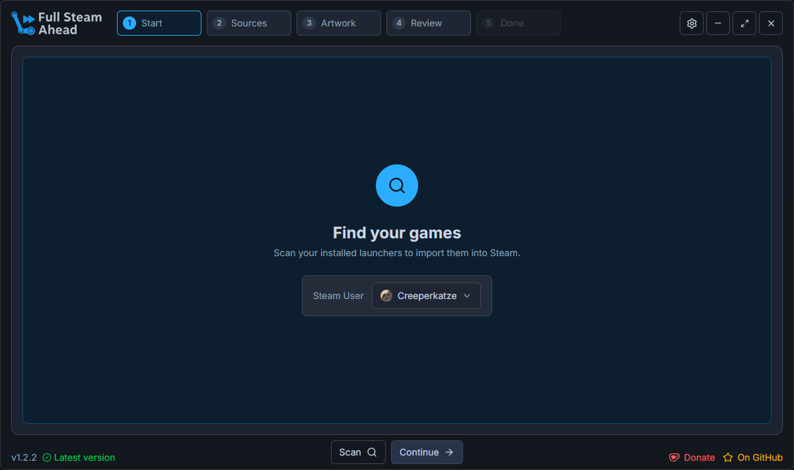<p align="center"><sub>Pick your Steam user</sub></p></td>
<td width="33%">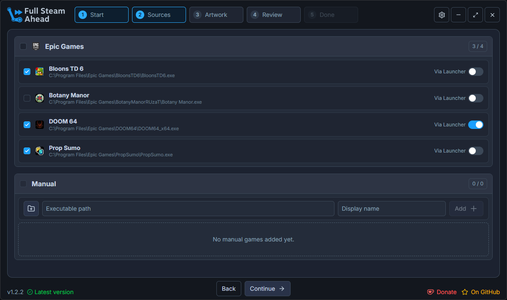<p align="center"><sub>Choose which games to import</sub></p></td>
<td width="33%">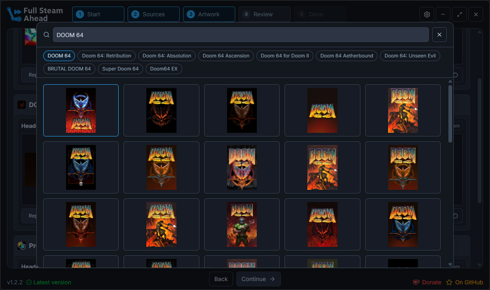<p align="center"><sub>Browse custom artwork on SteamGridDB</sub></p></td>
</tr>
<tr>
<td width="33%">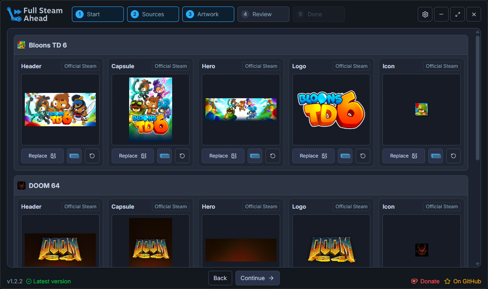<p align="center"><sub>Review matched grid images, heroes, and logos</sub></p></td>
<td width="33%">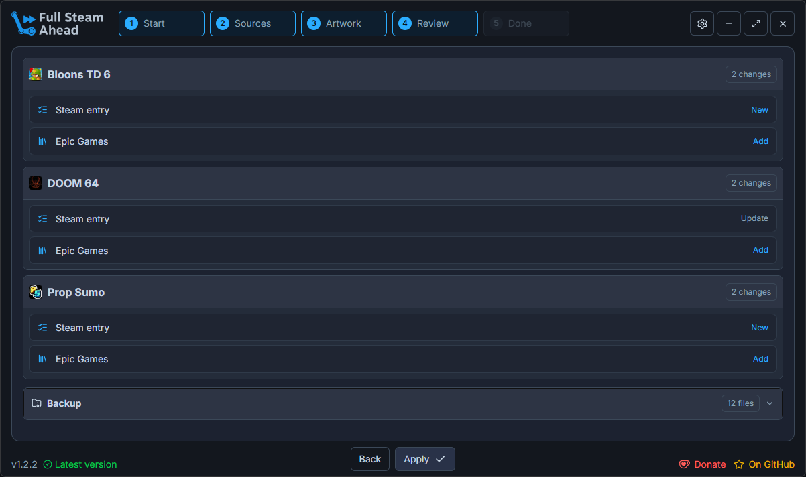<p align="center"><sub>Review every change before it's applied</sub></p></td>
<td width="33%">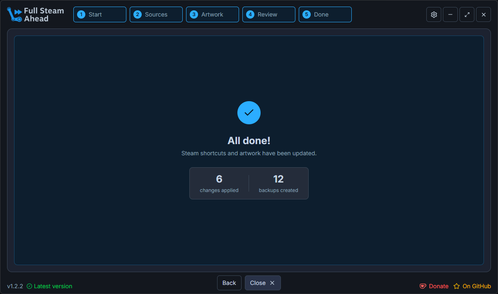<p align="center"><sub>All done, with an automatic backup</sub></p></td>
</tr>
</table>

<details>
<summary>Settings</summary>
<br>

<table>
<tr>
<td width="33%">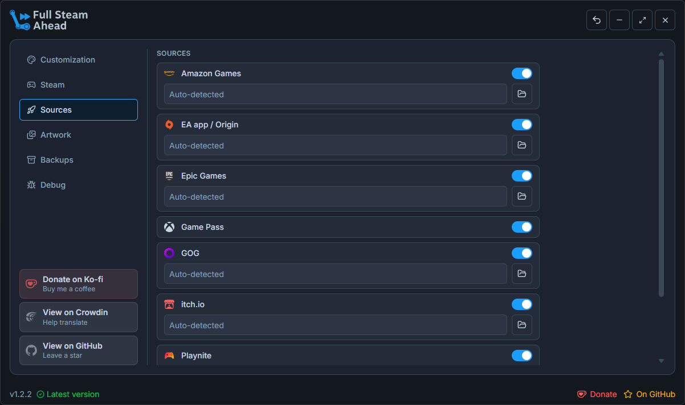<p align="center"><sub>Toggle and configure sources</sub></p></td>
<td width="33%">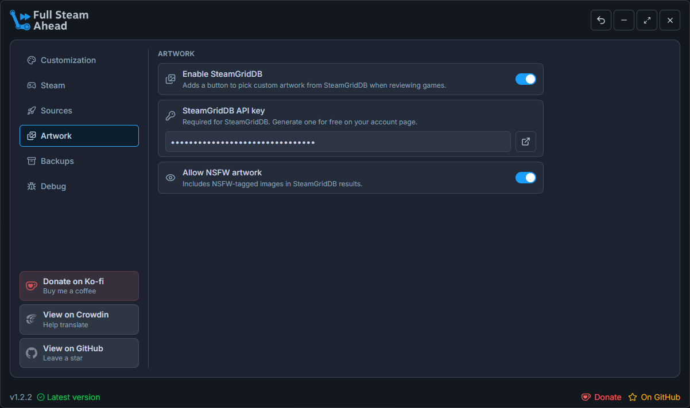<p align="center"><sub>Artwork options</sub></p></td>
<td width="33%">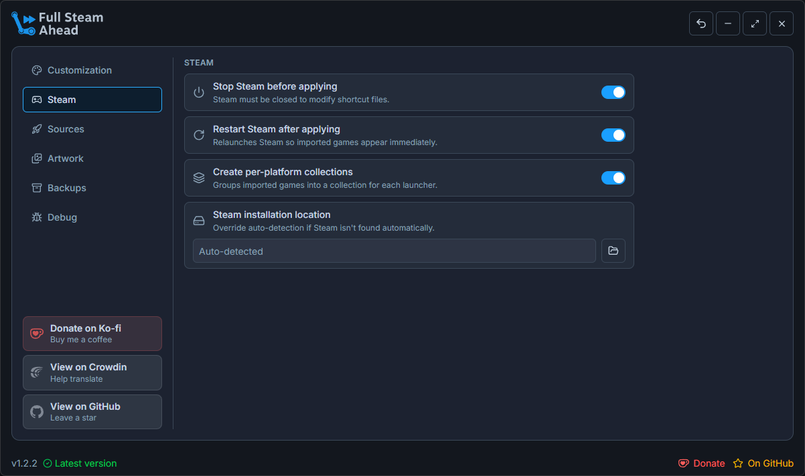<p align="center"><sub>Steam behavior</sub></p></td>
</tr>
<tr>
<td width="33%">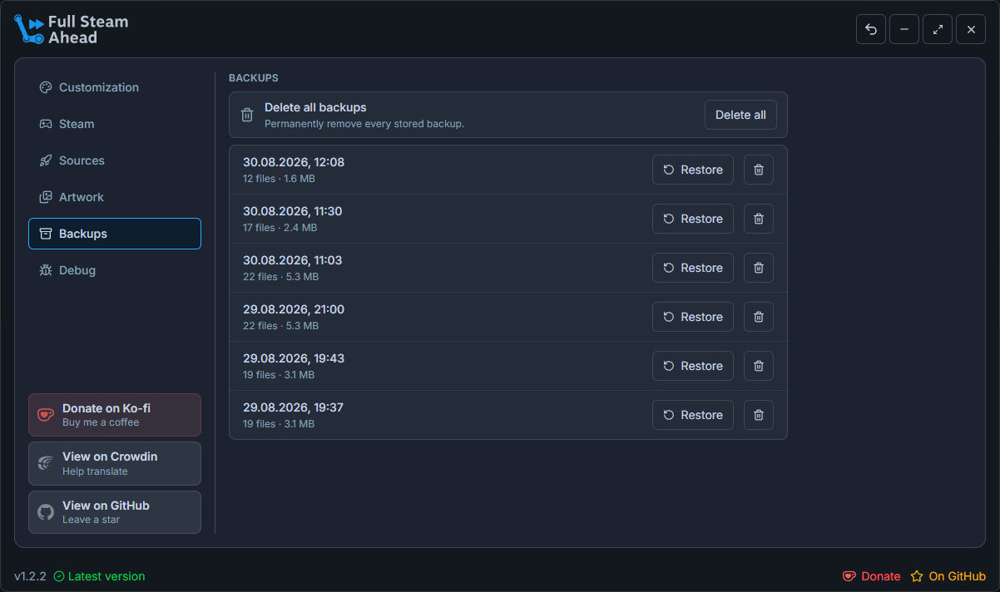<p align="center"><sub>Manage and restore backups</sub></p></td>
<td width="33%">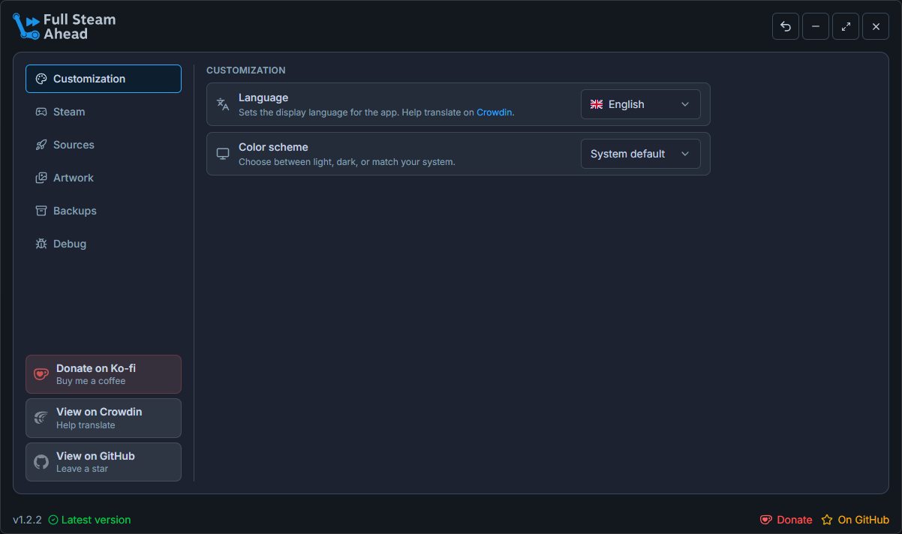<p align="center"><sub>Language and color scheme</sub></p></td>
<td width="33%">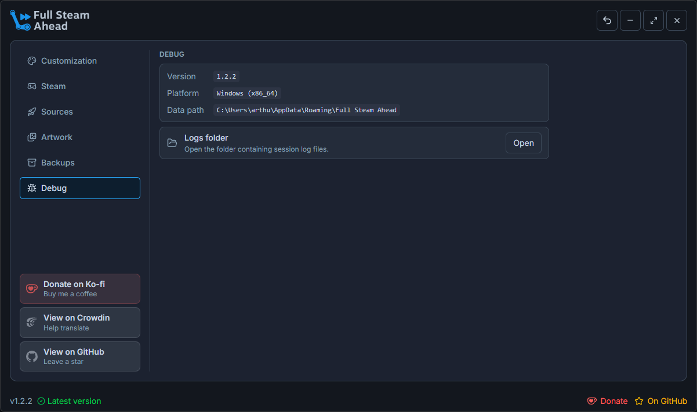<p align="center"><sub>Debug info and logs</sub></p></td>
</tr>
</table>

</details>

## ✨ Features

### Platforms

Automatically detects installed games from a wide range of launchers and platforms:

| Platform | Windows | macOS | Linux |
|---|---|---|---|
| Epic Games | ✅ | ✅ | ✅ |
| GOG | ✅ | ❌ | ✅ |
| itch.io | ✅ | ✅ | ✅ |
| EA App / Origin | ✅ | - | ✅ |
| Ubisoft Connect | ✅ | - | ✅ |
| Amazon Games | ✅ | - | - |
| Xbox Game Pass | ✅ | - | - |
| Playnite | ✅ | - | - |
| Bottles | - | - | ✅ |
| Flatpak | - | - | ✅ |
| Heroic | ❌ | ❌ | ✅ |
| Legendary | ❌ | ❌ | ✅ |
| Lutris | - | - | ✅ |
| MiniGalaxy | - | - | ✅ |
| Proton | - | - | ✅ |

### Artwork management

Fetches and applies grid images, hero art, and logos for your imported games using matched Steam assets.

### Collections

Organizes imported games into Steam collections so your library stays tidy.

### Preview & backup

Review the full list of changes before anything is applied. A backup is created automatically so you can always roll back.

### Manual import

Add any executable as a custom non-Steam game with your own launch options.

### Automatic Steam restart

After importing, Full Steam Ahead detects and restarts Steam so your new shortcuts show up immediately.

## ⚙️ Setup

1. Launch Full Steam Ahead.
2. The app will detect your Steam installation automatically.
3. Choose which games to import, review the artwork, and confirm the changes.

## 🔒 Building from source

**Prerequisites:** [Node.js](https://nodejs.org), [pnpm](https://pnpm.io), and [Rust](https://rustup.rs)

```bash
# Clone the repository
git clone https://github.com/creeperkatze/full-steam-ahead.git
cd full-steam-ahead

pnpm install

# Build for your platform
pnpm build
```

The resulting installer is placed in `src-tauri/target/release/bundle/`.

## 👨‍💻 Development

### Setup

```bash
git clone https://github.com/creeperkatze/full-steam-ahead.git
cd full-steam-ahead

pnpm install
```

### Running

```bash
pnpm dev
```

## 🌐 Translating

Translations are managed on [Crowdin](https://crowdin.com/project/full-steam-ahead). You can contribute without any technical knowledge, just pick your language and start translating.

New translations are automatically pulled every Monday.

## 🤝 Contributing

Contributions are always welcome!

Please ensure you run `pnpm lint` before opening a pull request.

## 📜 License

AGPL-3.0
